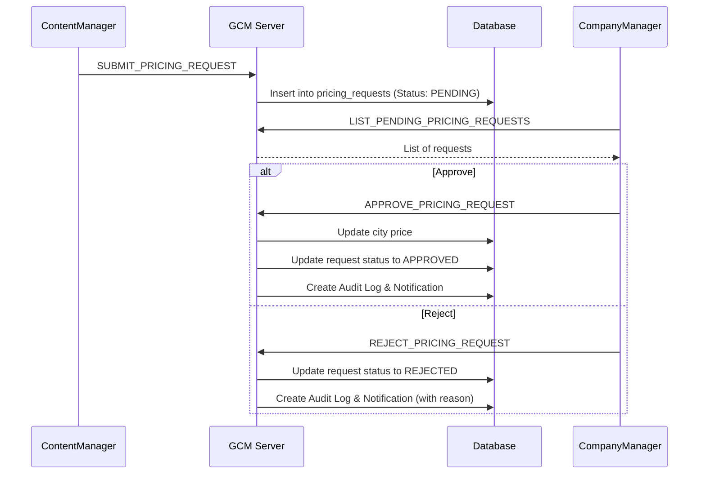

# Phase 8 Implementation Report: Pricing System

## Overview
This document details the implementation of **Phase 8 (Pricing System)** for the GCM (Global Content Management) system. The goal of this phase was to enable a workflow where Content Managers can propose price changes for cities, and Company Managers can review, approve, or reject these requests.

## Implemented Components

### 1. Database Schema
New tables and updates in `dummy_db.sql`:
*   **`pricing_requests`**: Stores pricing change requests.
    *   Columns: `id`, `city_id`, `current_price`, `proposed_price`, `status` (PENDING, APPROVED, REJECTED), `reason`, `rejection_reason`, `created_by`, `approved_by`, `created_at`, `processed_at`.
    *   Foreign keys linking to `cities` and `users`.
*   **User Updates**: Added `comanager` user (Role: `COMPANY_MANAGER`) for testing approval workflows.

### 2. Server-Side Architecture
*   **DTOs (Data Transfer Objects)**:
    *   `PricingRequestDTO`: Complete representation of a pricing request for client display.
    *   `SubmitPricingRequest`: Payload for submitting a new request.
    *   `ApprovePricingRequest`: Payload for approving/rejecting a request.
*   **DAO (Data Access Object)**:
    *   `PricingDAO`: Handles all SQL operations (CRUD for requests, fetching current prices, atomic transactions for approval).
*   **Handler**:
    *   `PricingHandler`: Processes incoming `Message` objects, performs validation, logging, and routing to DAO methods.
*   **Message Types**:
    *   `GET_CURRENT_PRICES`: Fetch city prices.
    *   `SUBMIT_PRICING_REQUEST`: Submit a new price proposal.
    *   `LIST_PENDING_PRICING_REQUESTS`: List requests awaiting approval.
    *   `APPROVE_PRICING_REQUEST`: Approve a price change.
    *   `REJECT_PRICING_REQUEST`: Reject a price change.

### 3. Client-Side Implementation
*   **GUI Screens**:
    *   **PricingScreen** (`pricing_screen.fxml`): 
        *   Accessible by Content Managers and Employees.
        *   Displays list of cities and current prices.
        *   Form to submit new price proposals with validation (positive price, reason length).
        *   Real-time calculation of percentage change.
    *   **PricingApprovalScreen** (`pricing_approval.fxml`):
        *   Accessible by Company Managers only.
        *   Displays table of pending requests.
        *   Shows detailed comparison of Current vs. Proposed price.
        *   Approve and Reject (with reason) actions.
*   **Dashboard Integration**:
    *   Added **Pricing Card** (Green) for Content Managers/Employees.
    *   Added **Approve Prices Card** (Red) for Company Managers.
    *   Role-based visibility implemented in `DashboardScreen.java`.

### 4. Validation & Security
*   **Input Validation**:
    *   Price must be positive and ≤ 10,000.
    *   New price must differ from current price.
    *   Reason must be at least 10 characters long.
*   **Role-Based Access Control**:
    *   Server-side checks ensure only authorized roles can submit or approve requests.
*   **Audit Logging**:
    *   All actions (`PRICING_REQUESTED`, `PRICING_APPROVED`, `PRICING_REJECTED`) are logged to the `audit_log` table.
*   **Notifications**:
    *   Submitters receive system notifications when their requests are approved or rejected.

## Usage Guide

### For Content Managers (Submitting a Request)
1.  Log in as a Content Manager (e.g., `manager`).
2.  Click the **Pricing** card on the Dashboard.
3.  Select a city from the list.
4.  Enter the new **Proposed Price** and a **Reason**.
5.  Click **Submit Pricing Request**.

### For Company Managers (Approving/Rejecting)
1.  Log in as a Company Manager (e.g., `comanager`).
2.  Click the **Approve Prices** card on the Dashboard.
3.  Select a pending request from the table.
4.  Review the details and percentage change.
5.  Click **Approve** to immediately update the price, or **Reject** (popup will ask for a reason).

## Technical Details

### Workflow Diagram

### Testing Status
*   **Compilation**: Clean build with `mvn compile`.
*   **Scenarios Verified**:
    *   Submission of valid/invalid prices.
    *   Role-based screen access.
    *   Approval workflow database updates.
    *   Rejection workflow with reason capture.
